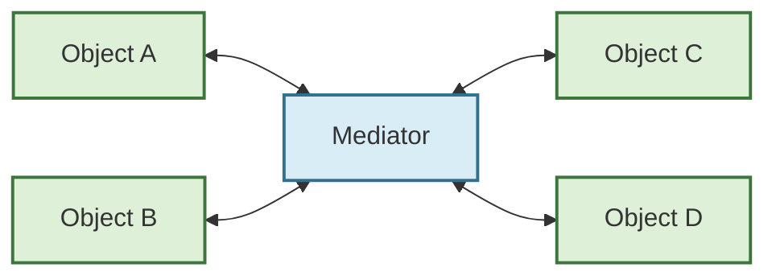
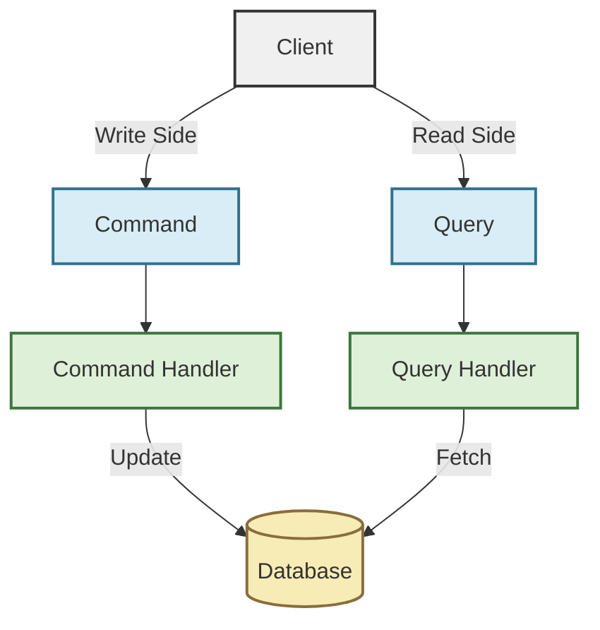
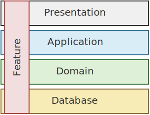

# Patterns

Design patterns relevant to this framework

## Mediator Pattern

The Mediator Pattern is a behavioral design pattern that facilitates communication between components or objects by introducing a mediator object. Instead of components communicating directly with each other, they interact through the mediator, which centralizes and manages the interactions. This reduces the dependencies between components, promoting loose coupling and making the system easier to maintain and extend.

## Command Query Responsibility Segregation (CQRS) Pattern

The Command Query Responsibility Segregation (CQRS) Pattern is a design pattern that separates the responsibilities of reading data (queries) and modifying data (commands) into distinct models. This separation allows for optimized handling of read and write operations, enabling scalability, performance improvements, and better maintainability.

References

- <https://learn.microsoft.com/en-us/azure/architecture/patterns/cqrs>
- <https://martinfowler.com/bliki/CQRS.html>

## Vertical Slice Architecture

The Vertical Slice Architecture is a design approach that structures an application into vertical slices, where each slice represents a complete feature or functionality. Each slice contains all the layers required to implement the feature, such as the user 
interface, business logic, and data access, minimizing dependencies between slices. This approach promotes modularity, maintainability, and scalability by isolating features and reducing cross-cutting concerns.

References

- <https://www.jimmybogard.com/vertical-slice-architecture/>
- <https://www.milanjovanovic.tech/blog/vertical-slice-architecture>
